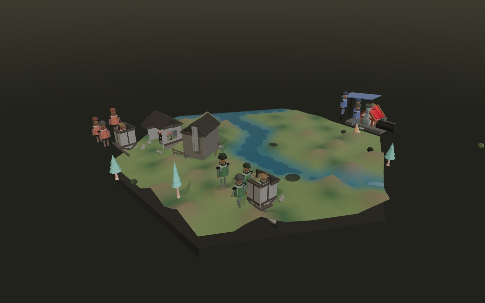
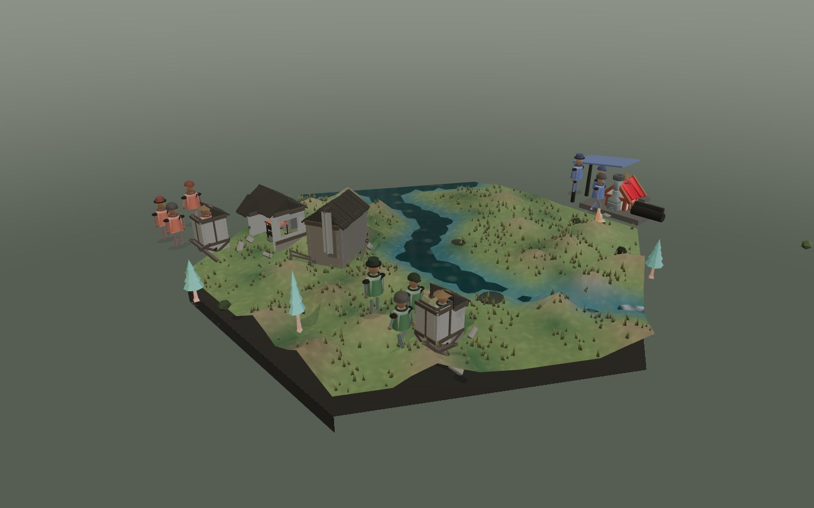

# Atmospheric world rendering

The renderer adds weathered ground, rippled water, dry ground cover and a layered overcast sky. This extends the existing ruined buildings and authored models; it does not change world simulation or persistence.

## Surface contract

`surface-materials.js` decorates only the named welded current/neighbor terrain and water materials. Detail is evaluated in world coordinates, with a shared origin derived from the loaded hex preview, rather than per-cell UVs. No terrain or water vertex is displaced: shared seam vertices, normals supplied by the stitcher and picking coordinates remain authoritative.

Land has mineral grain, broad soil variation, damp lowland shading and roughness variation. HIGH/ULTRA add derivative bump normals. Water uses crossed wave normals and subtle moving highlights. Current and neighboring water use the same opaque, depth-writing PBR response to avoid transparent sorting discontinuities. SAFE and reduced-motion mode stop cosmetic time; simulation and resident animation are not paused.

Existing material hooks are chained. Material program keys distinguish land/water and bump/flat variants. A WeakMap makes decoration idempotent without retaining discarded regions; cloned materials receive a fresh hook even when their userData was copied.

## Ground cover

Ground-cover placement samples the actual rendered triangles deterministically. It excludes submerged triangles and occupied structure cells and never consumes the simulation RNG. One InstancedMesh contains all tufts in the focused region. It receives shadows but does not cast expensive micro-shadows. The quality profile bounds the count; SAFE creates none.

The cover belongs to the terrain detail root. Terrain replacement disposes it along with the other decoration. Geometry changes and new occupied building positions also invalidate it. Adjacent live residents/buildings/resources and the static terrain-only outer ring retain their existing contracts; cosmetic grass is focused-region detail, not additional simulation state.

## Sky and lifecycle

A camera-centered shader provides a cool zenith, diffuse horizon and slow layered clouds, without a luminous sun orb or additional render targets. Its output explicitly uses the renderer's output color space. Existing scene exposure and deferred shadow/environment startup remain unchanged.

The optional module loads after terrain, stitching and decay extensions. Rebuilt and asynchronously arriving neighbor surfaces are decorated after stitching; a one-second sweep catches late topology conversions. Motion preference is observed without reloading. No new CDN, texture request, model request, post-processing dependency or full-screen rendering pass is added.

## Verification

Run `npm run build` for typechecking, the full test suite, browser syntax and authored-asset validation. The change adds 15 regressions covering shader composition/cache keys/clones, shared uniforms, welded geometry invariance, deterministic grounded cover, late neighbors, reduced motion and bootstrap order.

For optional local browser verification, install Playwright without changing the application dependencies:

```sh
npm install --no-save --package-lock=false playwright
npx playwright install chromium
node tools/render-graphics-smoke.mjs before
node tools/render-graphics-smoke.mjs after
```

The browser check captures a fixed demo state/camera, loads every authored asset, records shader/runtime errors and GPU resource counts, then replaces terrain four times to detect resource growth. It runs HIGH, BALANCED, SAFE and reduced motion. `--high-only` is useful for repeat visual checks.

On the verification host, Chromium uses SwiftShader software rendering, not the Mac GPU. Frame timings from this harness are diagnostic only, not hardware FPS claims. The tested HIGH fixture adds one draw call (372 → 373), one geometry (231 → 232), and no textures (43 → 43). Four terrain replacements retain 232 geometries and 43 textures. All 253 tests and all 32 browser JavaScript syntax checks passed.

These are controlled demo-fixture comparisons, not captures of the live evolving simulation:




